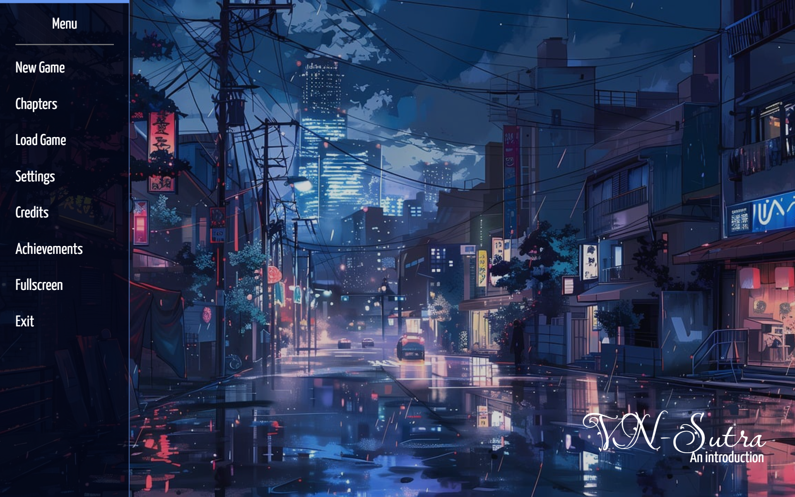
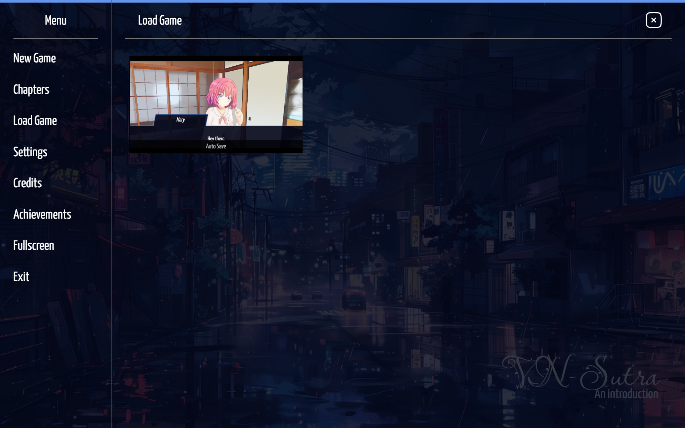
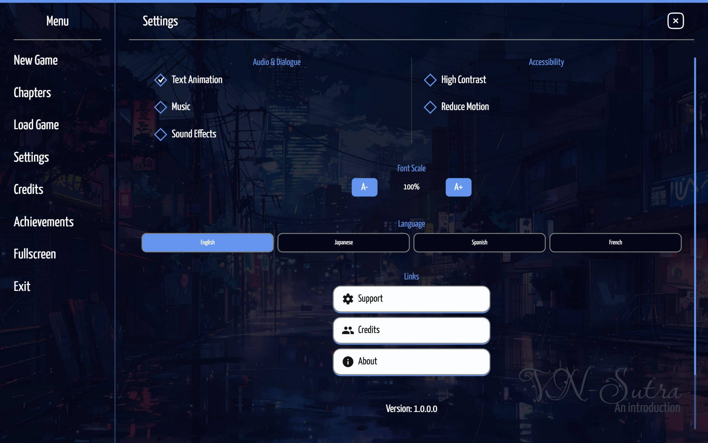
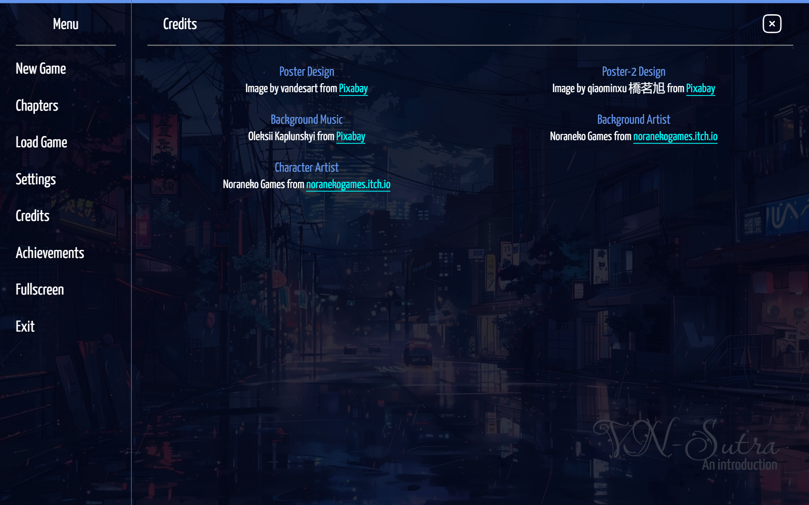
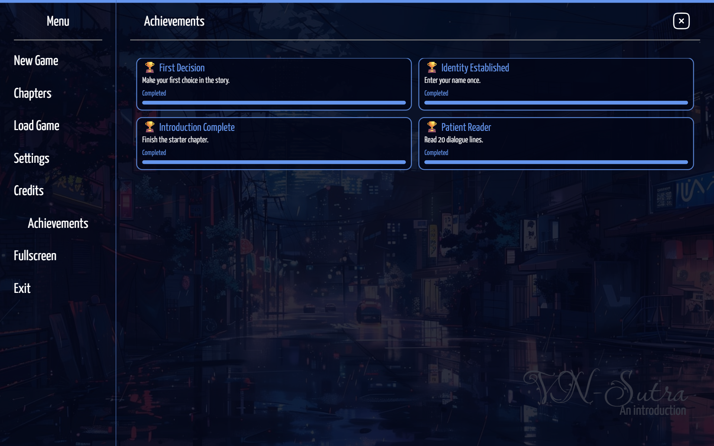
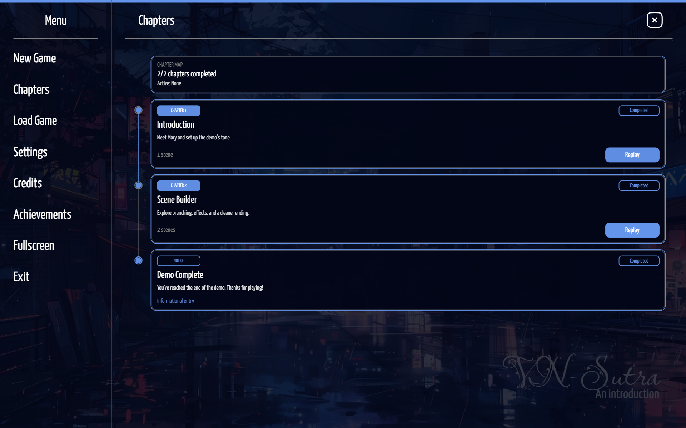
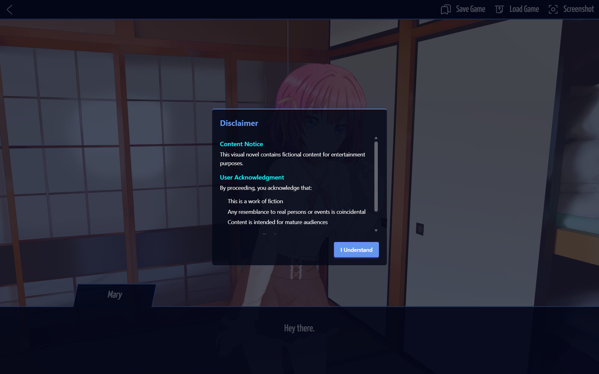
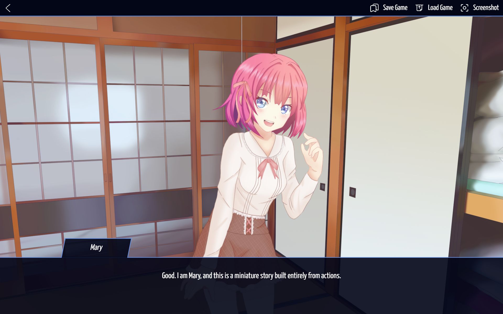
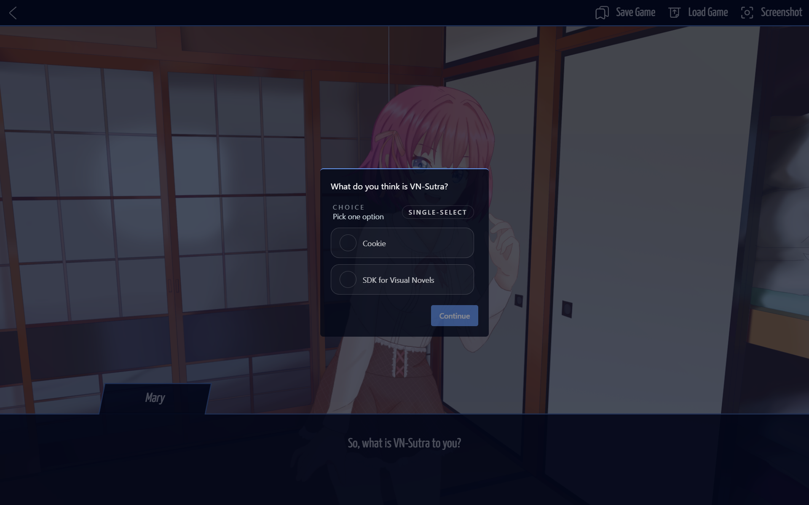

<!-- Title & badges -->
<h1 align="center">vnsutra</h1>

<p align="center">
  Modular Visual Novel SDK for the Web — build interactive visual novels with JavaScript.
</p>

<p align="center">
  <a href="https://www.npmjs.com/package/vnsutra"></a>
  <a href="https://github.com/tejasnayak25/vnsutra/actions"></a>
  <a href="https://github.com/tejasnayak25/vnsutra/blob/main/LICENSE"></a>
  <a href="https://github.com/tejasnayak25/vnsutra/issues"></a>
</p>

---

## Project Overview

vnsutra is a modular Visual Novel SDK that helps you author and ship browser-based visual novels. It provides:

- Modular game and UI modules in `vnsutra_modules/`.
- A story scripting system, assets pipeline, and save/load utilities.
- Local development tooling (dev server, Tailwind CSS watch, hot reload).

This repository includes an Express-based `api/` server used for local development and packaging, plus build scripts for production bundles.

---

## Quick Start

Install dependencies and run the full local development environment:

```bash
npm install
npm run dev
```

What this runs (concurrently):

- `dev:server` — Express dev server with `nodemon` (api/dev.js)
- `dev:css` — Tailwind CSS watch that compiles `css/input.css` → `css/output.css`
- `dev:reload` — simple reload server (`dev-server.js`) used by the UI
- `story:watch` — watches story files and rebuilds during editing

Open http://localhost:3000 (or the port printed by `api/dev.js`).

---

## Setup

Prerequisites:

- Node.js 20.x (per `engines` in `package.json`)
- npm 8+ (or yarn/pnpm)

Install dependencies:

```bash
npm install
```

Build production CSS once (optional):

```bash
npm run build:css
```

---

## Development

Local development commands (high-level):

- `npm run dev` — Start all dev helpers (server, CSS watch, reload, story watch).
- `npm run dev:server` — Start only the Express dev server (`api/dev.js`) with `nodemon`.
- `npm run dev:css` — Tailwind CSS watch mode.
- `npm run dev:reload` — Start the reload helper `dev-server.js`.

Build commands:

- `npm run build` — Full build: story build, UI build, then `scripts/build.js`.
- `npm run build:bundle` — Build + webpack production bundle + bundle script.
- `npm run build:css` — Compile and minify CSS for production.

Notes:

- The dev server serves `api/` routes and static assets; see [api/index.js](api/index.js) and [api/dev.js](api/dev.js).
- The UI build pipeline is in `scripts/ui-build.js` and `webpack.config.cjs`.

---

## Tests & Linting

- Run tests: `npm test`
- Run tests with coverage: `npm run test:coverage`
- Lint: `npm run lint` — autofix with `npm run lint:fix`
- Format: `npm run format`

The repository uses Jest for unit and integration tests; many tests live in `tests/`.

---

## Contributing

Contributions are welcome. Recommended workflow:

1. Fork the repo and create a topic branch.
2. Run `npm install` and `npm run dev` to verify dev experience.
3. Add tests where applicable and run `npm test`.
4. Open a pull request describing the change.

Please follow the coding conventions (ES modules, JSDoc for public APIs). Pre-commit hooks are enabled via `husky` and `lint-staged`.

---

## Files of Interest

- `api/` — Express server and development entry points
- `vnsutra_modules/` — Core SDK modules used by games
- `scripts/` — Build scripts (`story-build.js`, `ui-build.js`, `build.js`)
- `css/input.css` → `css/output.css` — Tailwind input/output

---

# Screenshots

Here are some screenshots of the vnsutra demo game:

<div align="center" style="overflow-x:auto; white-space:nowrap;">
  
  
  
  
  
  
  
  
  
</div>


## License

This project is licensed under the MIT License. See the `LICENSE` file for details.

---

If you'd like, I can also:

- Add or update CI workflow badges to match the repo's Actions file.
- Commit this change and create a branch/PR for review.
